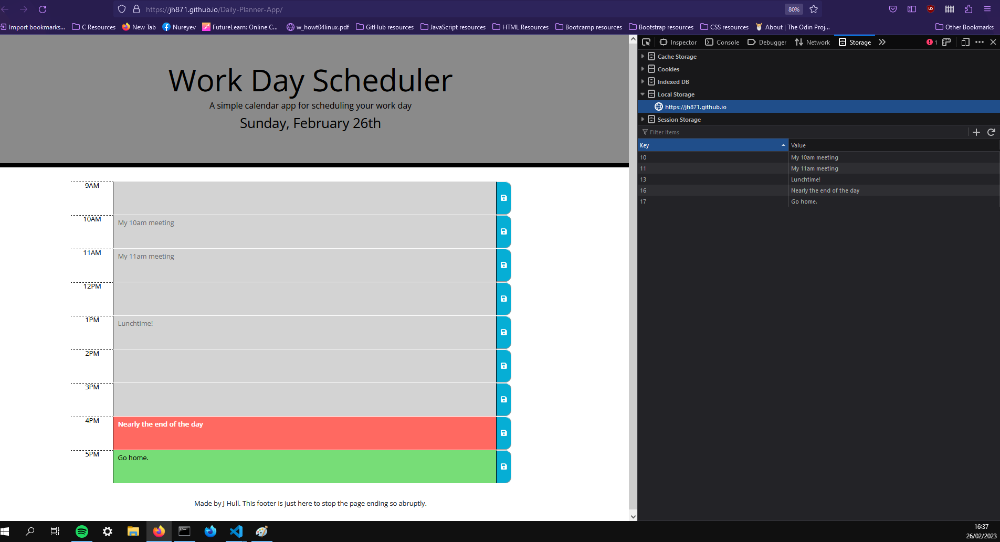

# Daily Planner App
Created by Jennifer Hull

## Description
This application is a daily planner that allows a user to view and set their hourly schedule for a typical work day.

------
## Installation & Usage
This application can be launched in browser from the url. It can be used to save a day's schedule by selecting the text area for the hour, typing in some content and clicking the blue save button next to that hour.

The planner has today's date at the top so the user know which day they are using the app for.

------
## Development
This application runs on JavaScript using some JQuery. It was built in HTML with styling in CSS. The BCS starter code for this project included classes that allow the hours of the schedule to color-code whether they are past, current or future hours. 

This application also uses local storage for saving appointments to keep them consistently on the planner between page refreshes.

The floppy disk icons on the save buttons are free from Font Awesome (https://fontawesome.com/).

Moment.js (https://momentjs.com/docs/#/displaying/) is used to display the correct date at the top of the page, and also for checking which tense (past, present, future) each time block is compared to the current time.

------
## My Experience 
While building this project my greatest challenge was writing concise js logic for the save buttons; Each text area has its own save button for pushing the content to local storage, and I'm sure there is some iteration or if-else that could be written once and applied to every button, but I couldn't work it out at this time. To get past this and just make the app run I have written out event listener code for every save button that grabs the specific text area and saves it to local storage.

In future for this app I would like to get the code more concise. I would also like to add clear buttons to each hour - the user can currently clear a field by removing the text and then clicking save, which simply stores a blank string to local storage, but having a single button which actually cleared the content from local storage would give a better user experience.

------
## License
This repo has an MIT license which can be seen in the files above.

------
## Links

### URL of deployed app:
https://jh871.github.io/Daily-Planner-App/

### URL of GitHub Repo:
https://github.com/jh871/Daily-Planner-App

------
## Screenshot of deployed application: 
Full screen including current time to demonstrate correct date and hour colour-coding, plus console to show local storage.

